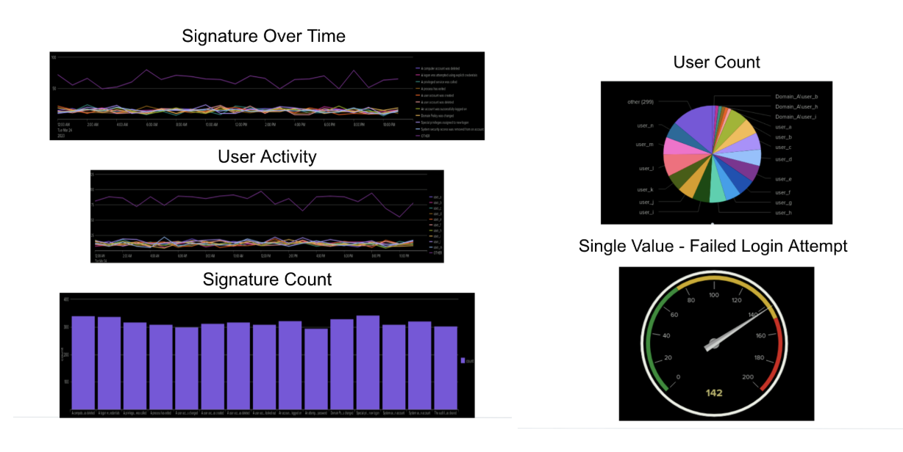

# VSI Threat Watch 

## Objective  
The VSI Threat Watch project aimed to design and deploy a defensive monitoring solution to detect and respond to cyber attacks targeting VSI’s Windows and Apache servers. Using Splunk Security Essentials, the project involved building reports, alerts, and dashboards to identify abnormal activity, analyze attack patterns, and recommend future mitigations based on post-attack log analysis.  

### Skills Learned  
- Building security reports and alerts in Splunk Security Essentials.  
- Establishing baselines and thresholds for anomaly detection.  
- Creating and interpreting Splunk dashboards for attack investigation.  
- Analyzing Windows Server and Apache HTTP logs for indicators of compromise.  
- Applying risk-based alerting aligned with MITRE ATT&CK and Cyber Kill Chain.  

### Tools Used  
- **Splunk Security Essentials (SSE)** – For log analysis, dashboards, and alerts.  
- **Windows Server Logs** – Login attempts, account deletions, severity events.  
- **Apache Server Logs** – HTTP requests, referrer domains, response codes, client IP addresses.

## Steps
### **1. Configured Monitoring Environment in Splunk**  
- Connected Windows and Apache server log sources to Splunk.  
- Verified log ingestion using Splunk Security Essentials data source validation.   

### **2. Built Windows Server Reports**  
- **Signature & Signature ID Report:** Counted and deduplicated Windows security events.  
- **Severity Report:** Calculated percentage breakdown of events by severity level.  
- **Status Report:** Counted events grouped by their status codes.  

*Ref 1: Windows Reports in Splunk*  
  

### **3. Created Windows Security Alerts**  
- **Failed Activity Threshold:** Triggered when failed logins exceeded 5–10/hour.  
- **Successful Logon Alert:** Triggered when successful logins exceeded 12–24/hour.  
- **User Deletion Alert:** Triggered when more than 2–3 user accounts were deleted per hour.  

*Ref 2: Windows Alerts Configuration*  
  

### **4. Built Windows Dashboards**  
- **Signature Over Time:** Visualized spikes in specific event signatures.  
- **User Activity:** Displayed login and account activity patterns.  
- **Single Value – Failed Logins:** Highlighted real-time failed login counts.  

*Ref 3: Windows Dashboard – Failed Login Tracking*  
  

### **5. Built Apache Server Reports**  
- **HTTP Methods Report:** Tracked usage of GET, POST, etc., over time.  
- **Top Domains Report:** Identified top 10 referrer domains.  
- **HTTP Response Report:** Counted and categorized HTTP status codes.  

*Ref 4: Apache Reports in Splunk*  
  

### **6. Created Apache Security Alerts**  
- **Activity by Country:** Triggered when non-U.S. traffic exceeded 300 hits/hour.  
- **HTTP POST Activity:** Triggered when POST requests exceeded 5/hour.  

*Ref 5: Apache Alerts Configuration*  
  

### **7. Built Apache Dashboards**  
- **HTTP Method Cluster Map:** Visualized global request patterns.  
- **URI Access Dashboard:** Highlighted access attempts to sensitive endpoints.  
- **User Agent Dashboard:** Analyzed client identifiers for anomalies.  

*Ref 6: Apache Dashboard – HTTP Method Map*  
  

### **8. Performed Attack Log Analysis**  
**Windows Findings:**  
- Spikes in failed logins and account deletions during the attack window.  
- Successful logon spikes detected, suggesting compromised accounts.  

**Apache Findings:**  
- Surge in POST requests indicating potential uploads or injection attempts.  
- Foreign IP activity linked to suspicious access patterns.  

*Ref 7: Attack Timeline in Splunk*  
  

### **9. Recommended Future Mitigations**  
- Enable Multi-Factor Authentication (MFA).  
- Deploy Web Application Firewall (WAF).  
- Increase login failure alert sensitivity.  
- Conduct regular threat hunting.  
- Expand Splunk alerting to abnormal file activity and privilege escalation attempts.  
